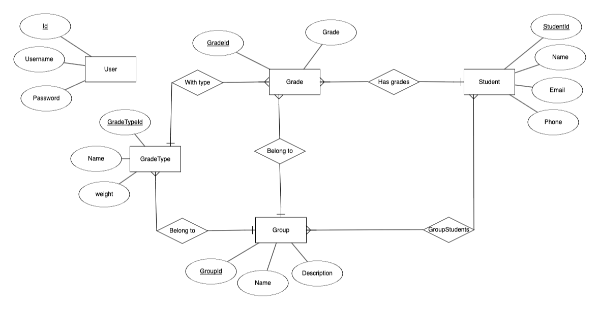
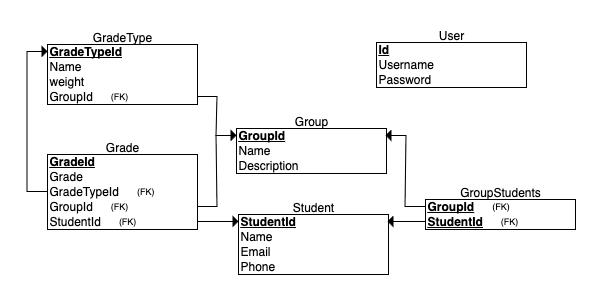

# Software Engineering Project 1

## Teacher’s Gradebook and Report Card System

## Team Members
- Jia Ke
- Wang Qingyun
- Yang Yang

## Description
This project is a desktop application that allows teachers to manage student
grades, calculate averages, and generate report cards. It uses JavaFX for the
user interface and MariaDB for database management, with JDBC for database
interaction.

## Documentation
- [Product Vision](docs/product_vision_group3.pdf)
- [Project Plan](docs/project_plan_group3_v3.pdf)
- [User Stories](docs/UserStories.md)
- [Design](docs/Design.md)

## Database
- Put all the database modification into database.sql

