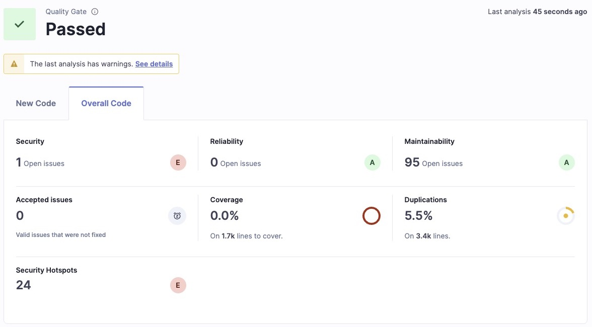
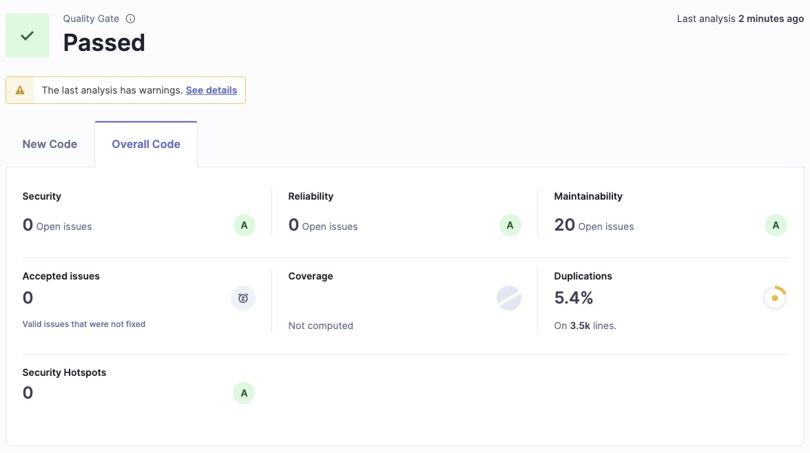

# 📋 Code Review Report

> **Project Name**:  Teacher’s Gradebook and Report Card System
> **Branch**: `main`  
> **Commit**: `fa68e64e4be188beac30dc8a67499fa3565a05e9`  
> **Review Date**:  Sprint 6
> **Reviewer**: Jia Ke, Wang Qingyun, Yang Yang
> **Tools**: SonarQube (v9.x), Java 17

---

## 🧭 1. Overview (SonarQube Summary)

| Metric                 | Value       | Note                          |
|------------------------|-------------|-------------------------------|
| **Security**           | 1           | 🔴 High severity              |
| **Security Hotspots**  | 24          | 🔴 High severity              |
| **Maintainability**    | 20          | 🔴 High severity              |
| **Maintainability**    | 30          | 🟡 Medium severity            |
| **Maintainability**    | 45          | 🟡 Low severity               |
| **Duplications**       | 5.5%        | Acceptable level              |

---

## 🔍 2. Key Issues

### 🚨 High Priority

| Module/Class         | Description                     | Severity | Recommendation                 |
|----------------------|---------------------------------|----------|--------------------------------|
| `config.properties`  | API Key Security Risks          | High     | Removed from code repository   |
| `Controllers`        | Output the exception stack      | High     | Add logger instead of console  |
...

---

### ⚠️ Medium Priority

| Module/Class            | Description                        | Severity | Recommendation              |
|-------------------------|------------------------------------|----------|-----------------------------|
| `GradeBookView.java`    | Duplicate logic, low readability   | Medium   | Refactor into common method |
| `StudentController.java`| Duplicate logic, low readability   | Medium   | Refactor into common method |
| `GroupController.java`  | Duplicate logic, low readability   | Medium   | Refactor into common method |
| `GradeController.java`  | Duplicate logic, low readability   | Medium   | Refactor into common method |
...

---

## 🛠️ 3. Recommendations

- [ ] Fix all high severity issues and bugs
- [ ] Increase test coverage for critical modules to ≥ 80%
- [ ] Refactor duplicated code (use IntelliJ refactor tools)
- [ ] Consider integrating format checkers (e.g., Checkstyle, Spotless)

---

## 📎 4. Appendix

- 🔗 [SonarQube Dashboard](http://localhost:9000/dashboard?id=gradebook&codeScope=overall)
- 📸 Screenshots

- SonarQube Dashboard Before

- SonarQube Dashboard Now

---

